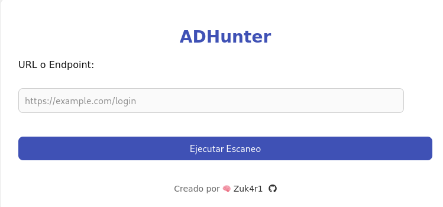
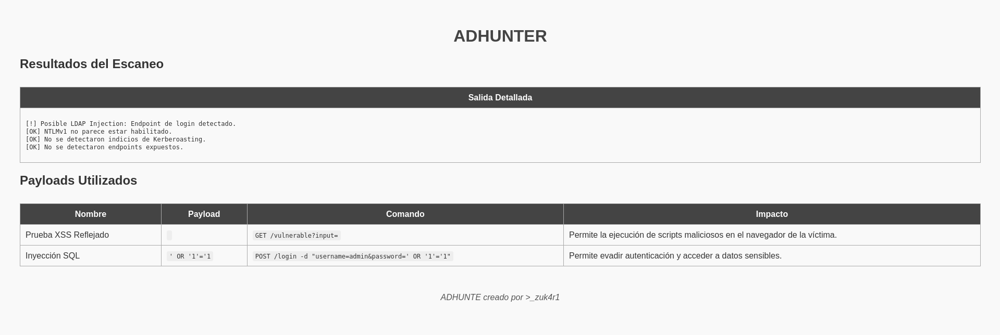

# ADHunter 🕵️‍♂️

**ADHunter** es una herramienta avanzada de auditoría de seguridad para **Active Directory**. Permite realizar análisis de seguridad en entornos corporativos detectando configuraciones inseguras, vulnerabilidades críticas y proporcionando reportes detallados en formato **HTML**.

---

## 📌 Características

- 🔍 Análisis de múltiples vectores de vulnerabilidad en **Active Directory**.
- 🛡️ Detección de configuraciones inseguras, como autenticaciones débiles o endpoints expuestos.
- 📄 Generación automática de reportes profesionales en **HTML**.
- ⚙️ Modular y extensible: permite añadir nuevas pruebas fácilmente.
- 🧠 Pruebas intrusivas opcionales para uso exclusivo en entornos autorizados **(bug bounty o pruebas controladas)**.

---

## 🚀 Instalación

```bash
git clone https://github.com/tuusuario/ADHunter.git
cd ADHunter
pip install -r requirements.txt
```

## 🛠️ Uso

```bash
python app.py
```
## 🌐 Interfaz grafica



## 📑 Resultado del escaneo

 

## 📊 Salida del Informe

**Los informes generados contienen:**

- Resumen de sistemas vulnerables y seguros.

- Tabla con el nombre de cada vulnerabilidad y su estado.

- Colores diferenciados para facilitar la visualización (vulnerable = rojo claro, seguro = verde claro).

## 📜 Licencia
Este proyecto está bajo la **Licencia MIT**. Consulta el archivo **LICENSE** para más detalles.

## ✍️ Autor
Creado con ❤️ por [@Zuk4r1](https://github.com/Zuk4r1).

# 🤝 Contribuciones

Se aceptan mejoras de código, contribuciones y sugerencias que hagan la herramienta **ADHunter** mas efectiva.
  <br />
	<br/>
      	<p width="20px"><b>Se aceptan donaciones para mantener este proyecto</p></b>
	      <a href="https://buymeacoffee.com/investigacq"></a><br />
      	<a href="https://www.paypal.com/paypalme/babiloniaetica"></a>
</div>

## ¡Feliz hackeo! 🎯
